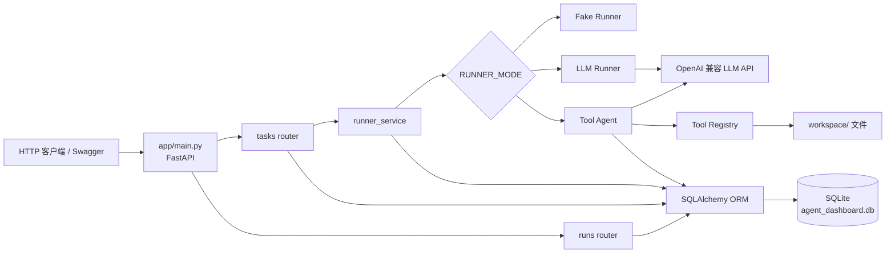

# Agent Dashboard Demo 项目总览

> [!summary] 一句话说明
> 一个用 FastAPI 提供任务管理 API、用 SQLite 保存执行轨迹，并可在 Fake、普通 LLM、Tool Agent 三种模式下执行任务的同步后端原型。

## 技术栈

| 层次 | 技术 | 项目中的用途 |
|---|---|---|
| Web | FastAPI、Uvicorn | 定义 API、依赖注入、运行 ASGI 应用 |
| Schema | Pydantic v2 | 请求校验及 ORM 响应序列化 |
| ORM | SQLAlchemy 2 | 声明模型、Session 和同步查询 |
| 数据库 | SQLite | 保存 Task、Run、RunLog、RunStep |
| LLM | OpenAI Python SDK | 调用 OpenAI 兼容的 Chat Completions 服务 |
| 配置 | python-dotenv | 从 `.env` 加载 LLM 与 Runner 配置 |
| Agent | 项目自建循环 | 解析模型 JSON、调用本地文件工具、记录步骤 |

## 启动入口

- 应用入口：`app/main.py` 中的 `app = FastAPI(...)`。
- 推荐启动命令：`uvicorn app.main:app --reload`。
- 启动导入期间会执行 `Base.metadata.create_all(bind=engine)`，创建缺失的 SQLite 表。
- 默认数据库：项目当前工作目录下的 `agent_dashboard.db`。
- 注意：`app.services.llm_client` 在模块导入时创建全局客户端，因此即使使用 Fake 模式，缺少 LLM 环境变量也可能导致应用导入失败。

## 核心目录

| 路径 | 角色 | 说明 |
|---|---|---|
| `app/routers/` | 入口层 | Task 和 Run HTTP 路由 |
| `app/services/` | 业务/Agent 层 | Runner 编排、提示词、LLM 客户端、Agent 循环 |
| `app/tools/` | 工具层 | Tool 抽象、文件工具与注册表 |
| `app/models.py` | 数据层 | 四个 SQLAlchemy ORM 实体 |
| `app/schemas.py` | API 契约层 | 请求/响应 Pydantic 模型 |
| `app/database.py` | 基础设施层 | SQLite Engine、Session、依赖注入 |
| `workspace/sample_project/` | Agent 数据区 | Tool Agent 被允许读取的样例项目；不是主应用入口 |

## 推荐阅读顺序

1. [[01-目录结构]]
2. [[02-整体架构图]]
3. [[03-核心调用链]]
4. [[04-核心模块拆解]]
5. [[05-数据流图]]
6. [[06-类和实体关系]]
7. [[07-API接口地图]]
8. [[08-依赖关系]]
9. [[09-新手阅读路线]]
10. [[10-待确认问题]]

## 整体架构

## 地图边界

本地图以当前 Git 跟踪文件为主要事实来源，并补充识别了未跟踪的空文件 `app/__init__.py`。扫描时按要求忽略虚拟环境、缓存、IDE、构建产物等目录。`workspace/sample_project/` 与主应用存在版本差异，文档将其视为 Agent 的样例输入，而非可独立启动的权威副本。
