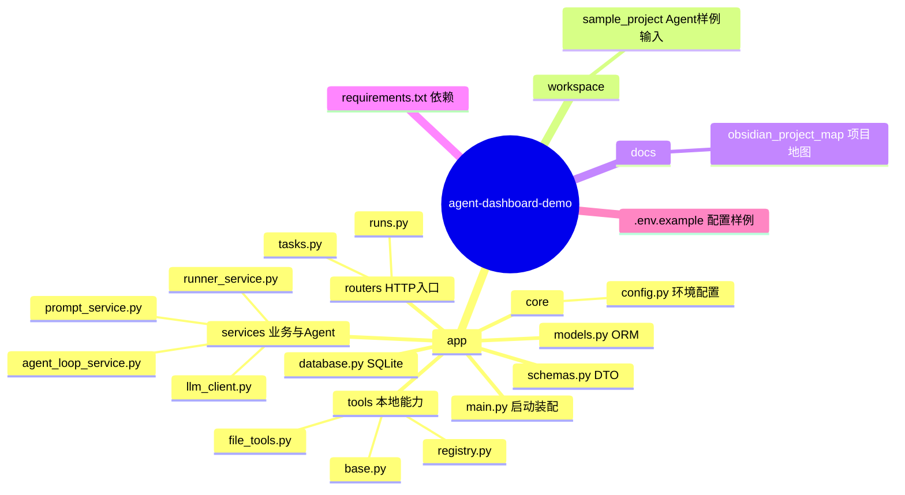

# 目录结构

返回首页：[[00-项目总览]]

## 项目树

```text
agent-dashboard-demo/
├── .env.example                 # 环境变量示例
├── .gitignore
├── requirements.txt             # Python 依赖锁定清单
├── app/
│   ├── main.py                  # FastAPI 入口与路由装配
│   ├── database.py              # SQLite Engine / Session / Base
│   ├── models.py                # ORM 实体
│   ├── schemas.py               # Pydantic API 契约
│   ├── core/
│   │   └── config.py            # 环境变量配置
│   ├── routers/
│   │   ├── tasks.py             # Task CRUD 与启动 Run
│   │   └── runs.py              # Run、日志、步骤查询
│   ├── services/
│   │   ├── runner_service.py    # 执行模式分派与状态落库
│   │   ├── agent_loop_service.py# Tool Agent 循环
│   │   ├── llm_client.py        # OpenAI 兼容客户端
│   │   └── prompt_service.py    # 普通任务与 Agent 提示词
│   └── tools/
│       ├── base.py              # Tool 包装类
│       ├── file_tools.py        # 受 workspace 限制的文件工具
│       └── registry.py          # 工具注册与统一调用
├── workspace/
│   └── sample_project/          # Agent 可分析的样例项目
└── docs/
    └── obsidian_project_map/    # 本项目地图
```

未发现 `tests/`、数据库迁移目录、前端目录、Docker 配置或 CI 配置。运行时数据库文件被 `.gitignore` 忽略。

## 分层定位

| 层 | 目录/文件 | 作用 |
|---|---|---|
| 启动与装配 | `app/main.py` | 创建应用、建表、挂载路由 |
| 入口/Controller | `app/routers/` | 将 HTTP 输入转为查询或 Service 调用 |
| API 契约 | `app/schemas.py` | 定义输入 DTO 和输出 DTO |
| 业务逻辑 | `app/services/runner_service.py` | 创建 Run、模式分派、状态及日志管理 |
| Agent | `app/services/agent_loop_service.py` | 多步模型决策、工具调用与步骤持久化 |
| 外部适配 | `app/services/llm_client.py` | 封装 Chat Completions |
| 数据层 | `app/models.py`、`app/database.py` | ORM 与 SQLite 连接 |
| 工具层 | `app/tools/` | 文件访问能力及注册表 |
| 受控数据区 | `workspace/` | 工具允许读取的根目录 |

## 目录关系



## 样例工作区的特殊性

`workspace/sample_project/app/` 外观接近主应用的早期副本，但缺少主应用已有的 `RunStep`、Agent loop 和 `/runs/{id}/steps`。其源码还有明显旧实现痕迹。因此它的设计意图推断为“供 Tool Agent 分析的样例代码”；是否需要与主应用长期同步，待确认。
