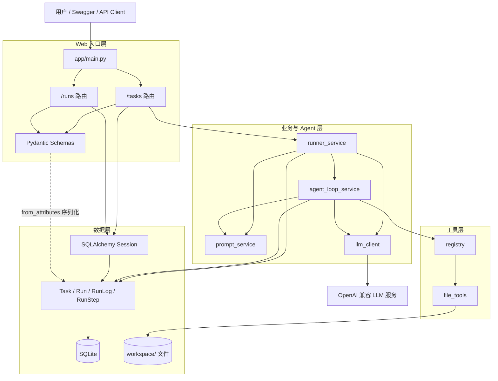

# 整体架构图

关联：[[00-项目总览]] · [[03-核心调用链]] · [[05-数据流图]]

## 请求到输出

## 各层职责

- 路由层只负责 HTTP、404 判断、Session 注入和调用业务函数；没有独立 Controller 类。
- Runner Service 是任务执行的事务式编排中心，但每次日志写入都单独 `commit`，并非一个数据库事务。
- Tool Agent 是最多 5 轮的同步循环。模型返回 JSON 后，系统决定结束或调用工具。
- 工具层只允许从解析后的 `workspace/` 根目录读取文件，不提供写入能力。
- 查询 API 直接访问 ORM，没有单独 Repository 层。
- 没有缓存、消息队列、后台任务系统；`POST /tasks/{id}/runs` 在请求内同步等待 LLM 和 Agent。

## 外部边界

1. HTTP 客户端：输入 Task、查询执行状态。
2. LLM API：由 `LLM_BASE_URL` 指向的 OpenAI 兼容服务。
3. 本地 SQLite：持久化全部业务状态。
4. 本地 `workspace/`：Tool Agent 的只读分析对象。

未发现认证、授权、限流、可观测性平台或远程文件存储。
