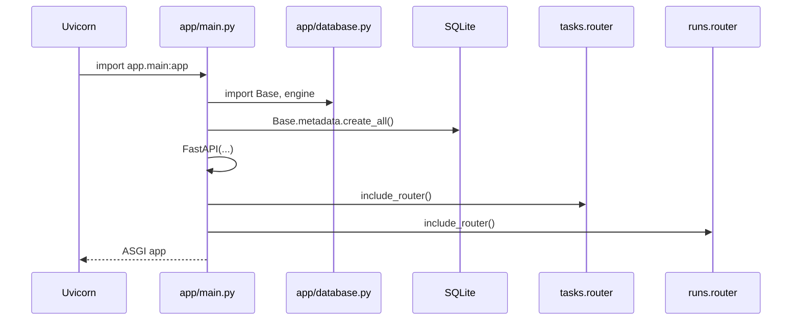
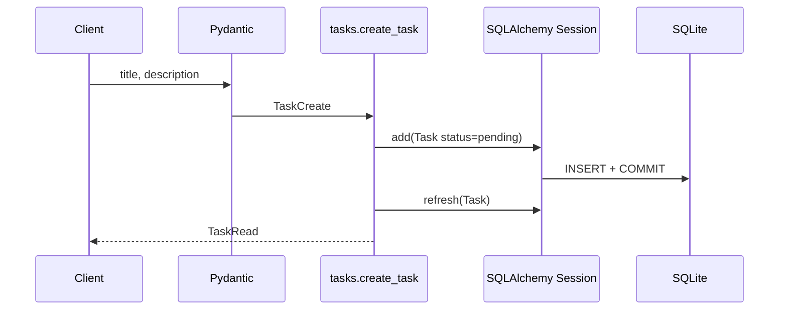
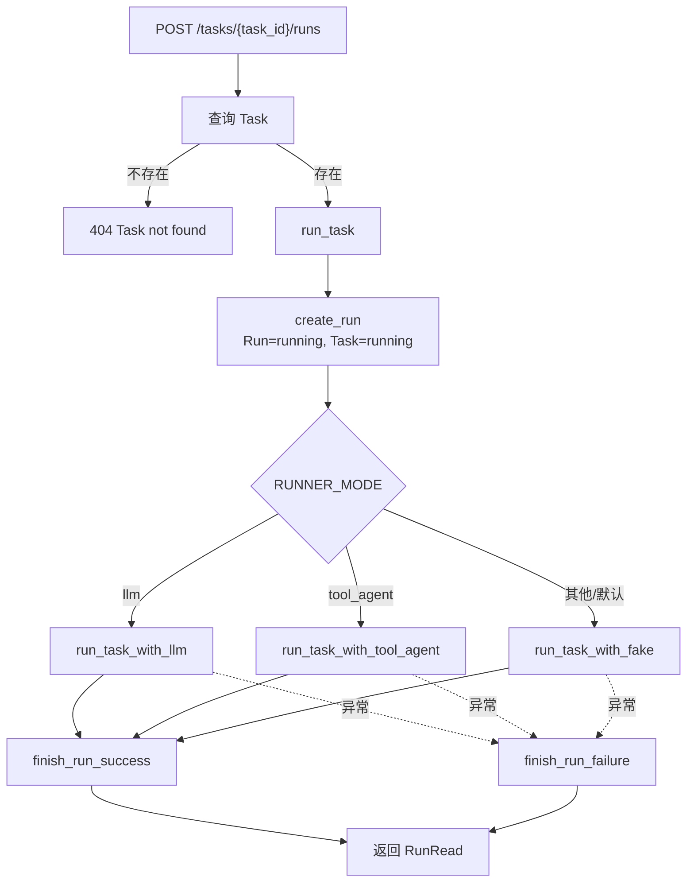
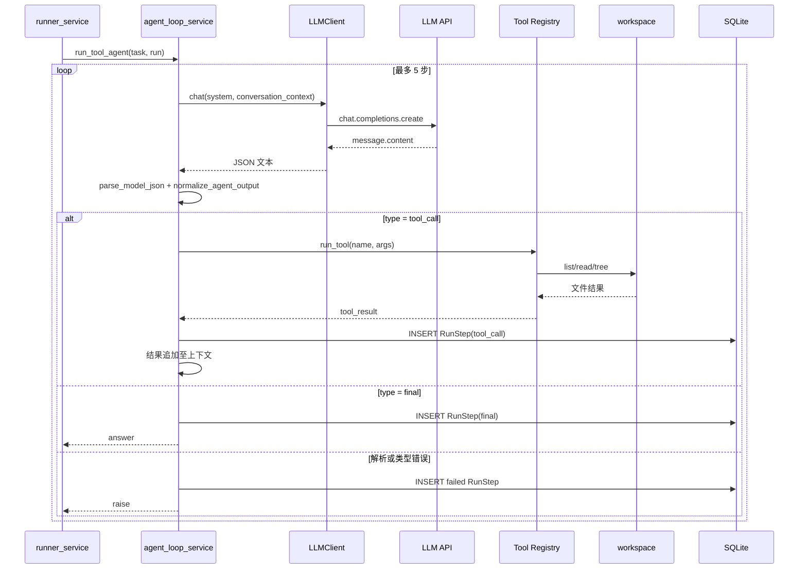
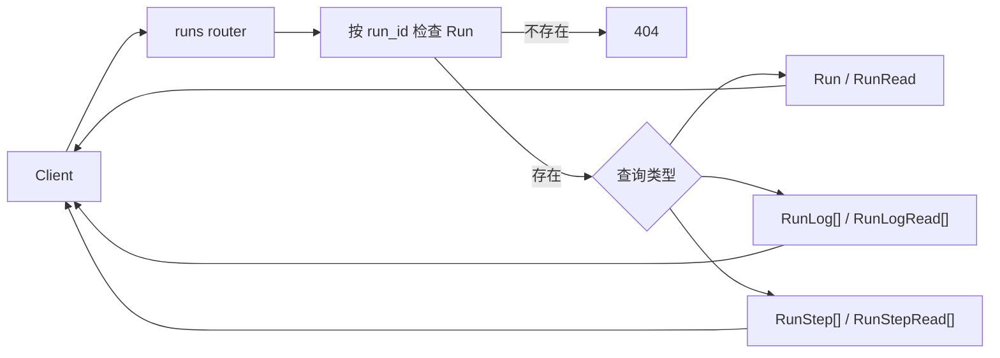

# 核心调用链

关联：[[02-整体架构图]] · [[04-核心模块拆解]] · [[07-API接口地图]]

## 1. 应用启动与路由装配

起点是 Uvicorn 导入 `app.main:app`。`main.py` 导入数据库和两个 Router，在导入期建表，随后挂载路由。

最终结果：FastAPI 应用暴露根路径、Task 和 Run 共 9 个接口。

## 2. 创建任务

起点：`POST /tasks`。请求体先按 `TaskCreate` 校验，随后 `create_task()` 构造 `Task`，提交并刷新。

最终结果：新增一条 `tasks` 记录，返回 `TaskRead`。

## 3. 启动一次任务执行

起点：`POST /tasks/{task_id}/runs`。`start_task_run()` 查询任务后进入 `run_task()`，创建 Run，再按 `RUNNER_MODE` 选择路径。

最终结果：正常或业务异常都会返回 `Run`；状态分别为 `success` 或 `failed`。

## 4. Tool Agent 多步执行

`run_tool_agent()` 生成提示词，最多循环 5 次。模型结果经 JSON 清洗和归一化后，要么保存 final step，要么调用工具并把结果追加到下一轮上下文。

最终结果：最终答案写入 `runs.result`；每次工具调用或错误写入 `run_steps`。

## 5. 查询执行轨迹

起点分别是 `/runs`、`/runs/{id}`、`/runs/{id}/logs`、`/runs/{id}/steps`。这些路由直接查询数据库，不经过 Service。

