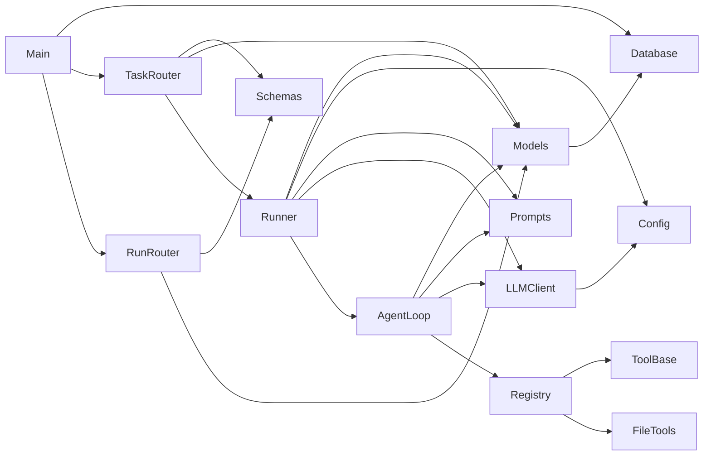

# 核心模块拆解

关联：[[01-目录结构]] · [[03-核心调用链]] · [[08-依赖关系]]

## `app/main.py`

- 导入：FastAPI；`Base`、`engine`；Task/Run routers。
- 核心行为：导入期 `create_all`，创建 `FastAPI` 实例，声明健康式根接口并挂载路由。
- 设计意图：轻量应用装配点。
- 被调用：由 Uvicorn 通过 `app.main:app` 导入。

## `app/core/config.py`

- 导入：标准库 `os` 与 `dotenv.load_dotenv`。
- `Settings`：读取 `LLM_BASE_URL`、`LLM_API_KEY`、`LLM_MODEL`、`LLM_TIMEOUT`、`RUNNER_MODE`。
- `settings`：模块级单例，被 LLM 客户端和 Runner 使用。
- 设计意图：集中环境配置；当前没有 Pydantic Settings 或运行时校验层。

## `app/database.py`

- 导入：SQLAlchemy `create_engine`、`sessionmaker`、`DeclarativeBase`。
- `engine`：连接相对路径 SQLite。
- `SessionLocal`：同步 Session 工厂。
- `Base`：ORM 声明基类。
- `get_db()`：FastAPI yield 依赖，确保请求结束关闭 Session。
- 被调用：`main.py`、所有 Router、`models.py`。

## `app/models.py`

- 导入：SQLAlchemy 字段、关系、JSON 类型，标准库 `datetime`，项目 `Base`。
- `Task`：任务定义与总体状态。
- `Run`：一次执行及结果/错误；属于 Task。
- `RunLog`：面向人的执行日志；属于 Run。
- `RunStep`：Tool Agent 的结构化步骤；属于 Run。
- 设计意图：用 RunLog 与 RunStep 分离“日志流”和“Agent 决策轨迹”。

## `app/schemas.py`

- 导入：Pydantic `BaseModel`、`ConfigDict` 与 `datetime`。
- `TaskCreate` 是输入 DTO。
- `TaskRead`、`RunRead`、`RunLogRead`、`RunStepRead` 是输出 DTO。
- Read 模型均启用 `from_attributes=True`，可直接序列化 ORM 对象。

## `app/routers/tasks.py`

- 导入：FastAPI Router/依赖/HTTPException、SQLAlchemy Session、Task ORM、Schema、`run_task`。
- `create_task()`：新增 Task。
- `list_tasks()` / `read_task()`：查询 Task。
- `start_task_run()`：查 Task，调用 Runner，返回 Run。
- 被调用：由 `main.py` 挂载。

## `app/routers/runs.py`

- 导入：FastAPI、Session、Run/RunLog/RunStep、对应 Schema。
- 四个查询函数直接访问 ORM。
- 设计意图：提供执行结果、日志和 Agent step 的只读观察面。

## `app/services/runner_service.py`

- 导入：`datetime`、Session、ORM、全局配置、Agent loop、LLM 客户端、提示词构建器。
- 状态函数：`create_run()`、`finish_run_success()`、`finish_run_failure()`。
- 日志函数：`add_log()`。
- 执行器：
  - `run_task_with_fake()` 返回固定文本。
  - `run_task_with_llm()` 构建普通提示词并调用一次模型。
  - `run_task_with_tool_agent()` 调用多步 Agent。
- `run_task()`：统一模式分派和异常转 failed Run。
- 被调用：`tasks.start_task_run()`。

## `app/services/agent_loop_service.py`

- 导入：JSON、类型、ORM、全局 LLM 客户端、Agent 提示词、工具注册表。
- `parse_model_json()`：兼容 Markdown fence 和外围文本。
- `normalize_agent_output()`：为缺失 `type` 但带 `tool_name`/`answer` 的结果补类型。
- `save_step()`：提交一个 RunStep。
- `run_tool_agent()`：最多 5 步的 ReAct 风格循环，但协议是项目自定义 JSON。

## `app/services/llm_client.py`

- 导入：OpenAI SDK 与 `settings`。
- `LLMClient.__init__()`：校验三项必需配置并创建客户端。
- `chat()`：调用 `chat.completions.create`，temperature 为 0.2，返回文本。
- 模块末尾创建 `llm_client` 单例；这是 import-time 外部配置耦合点。

## `app/services/prompt_service.py`

- 只导入 `Task` 用于类型与普通任务内容。
- 四个函数分别构造普通 LLM 与 Tool Agent 的 system/user prompt。
- Tool Agent prompt 明确列出工具、参数和 JSON 输出协议。

## `app/tools/`

- `base.py`：定义“接收参数字典并返回结果字典”的 `ToolFunc` 可调用类型，`Tool.run()` 转发调用。
- `registry.py`：注册 `list_files`、`read_file`、`get_project_tree`，未知工具及工具异常转换为结果字典。
- `file_tools.py`：用 `Path` 将访问限制到解析后的 `workspace/`，提供列目录、读文件（最多 8000 字符）和目录树。
- `pydantic.v1.PathError` 被导入但未使用。

## 模块依赖图

