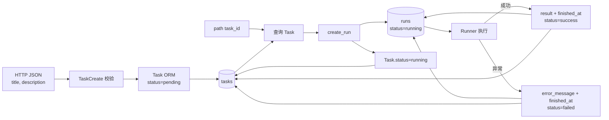
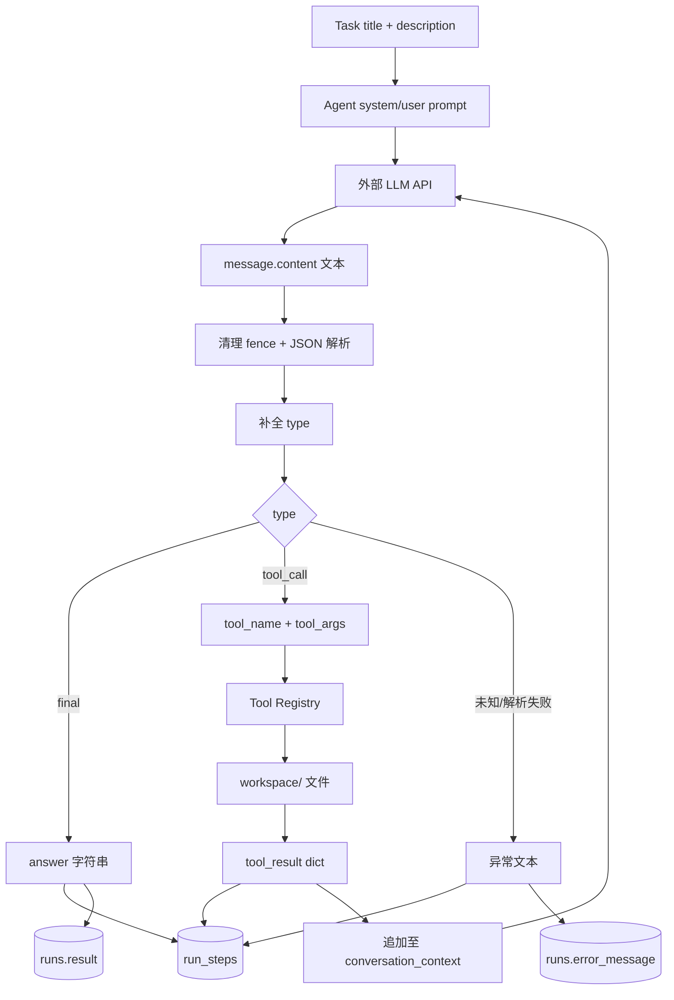

# 数据流图

关联：[[02-整体架构图]] · [[06-类和实体关系]] · [[07-API接口地图]]

## 主要输入与输出

| 数据 | 来源 | 中间形态 | 去向 |
|---|---|---|---|
| Task 创建请求 | HTTP JSON | `TaskCreate` → `Task` | SQLite `tasks` |
| task_id | URL path | Python `int` → ORM 查询 | Runner 或 404 |
| 执行配置 | `.env` / 进程环境 | `Settings` | Runner、LLMClient |
| 普通 LLM 提示词 | Task ORM | system/user 字符串 | 外部 LLM API |
| Agent 模型输出 | 外部 LLM API | 文本 → dict | final 或 tool_call |
| 工具参数 | Agent JSON | dict | `workspace/` 文件工具 |
| 工具结果 | 本地文件系统 | dict | RunStep + 下一轮 prompt |
| 执行结果 | Runner | 字符串 | `runs.result` → `RunRead` |
| 错误 | Python Exception | 字符串 | `runs.error_message` |

## Task 与 Run 数据流

## Tool Agent 数据流

## 持久化与非持久化数据

- 持久化：Task、Run、RunLog、RunStep。
- 非持久化：当前 Agent `conversation_context`、system prompt、OpenAI SDK response 对象。
- 文件读取：`workspace/` 内容只进入工具返回和 RunStep JSON；工具本身不修改文件。
- 缓存：未发现。
- 消息队列：未发现。
- 第三方 API：仅发现 OpenAI 兼容 Chat Completions。
- 事务：每次 `add_log()`、`save_step()`、状态更新均独立提交；跨步骤原子性不存在。
