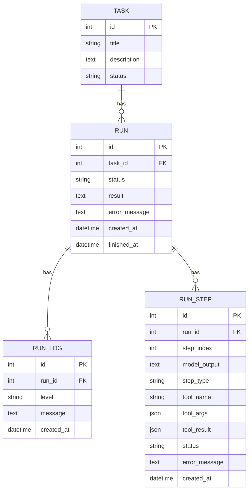
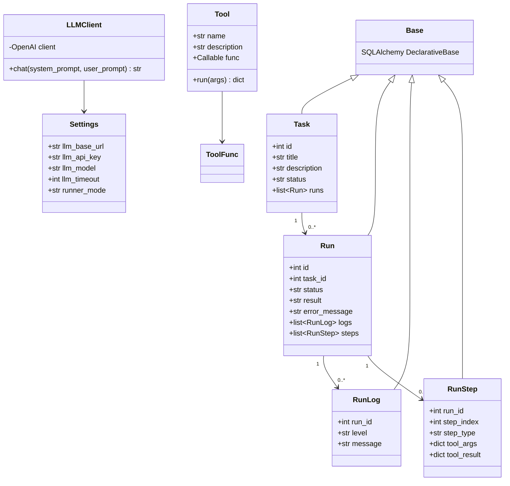

# 类和实体关系

关联：[[04-核心模块拆解]] · [[05-数据流图]]

## ORM 实体

关系均配置父侧 `cascade="all, delete-orphan"`；源码没有提供删除 API，因此级联行为目前不会通过公开接口触发。

## 主要类关系

## DTO / Schema / Entity 映射

| API Schema | 类型 | 对应实体 | 说明 |
|---|---|---|---|
| `TaskCreate` | 输入 DTO | `Task` | 只接受 title、description |
| `TaskRead` | 输出 DTO | `Task` | 暴露 id、内容和 status |
| `RunRead` | 输出 DTO | `Run` | 暴露执行状态、结果、错误和时间 |
| `RunLogRead` | 输出 DTO | `RunLog` | 暴露日志信息 |
| `RunStepRead` | 输出 DTO | `RunStep` | 暴露 Agent 模型输出与工具轨迹 |

所有输出 DTO 通过 `ConfigDict(from_attributes=True)` 从 ORM 属性取值。项目没有独立 Domain Entity；SQLAlchemy Model 同时承担持久化实体和业务状态对象。

## 状态值

- Task：`pending`、`running`、`success`、`failed`。
- Run：`running`、`success`、`failed`。
- RunStep：默认 `success`，解析/未知类型/最大步数用 `failed`。

这些状态目前是自由字符串，没有 Enum 或数据库约束。
