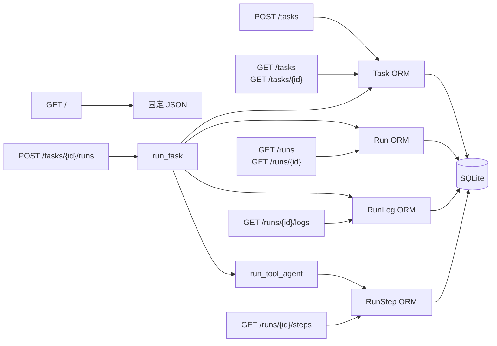

# API 接口地图

关联：[[03-核心调用链]] · [[06-类和实体关系]]

基础地址由部署决定；源码未设置全局 API prefix。FastAPI 默认提供 `/docs`、`/redoc` 和 `/openapi.json`。

## 路由列表

| 方法 | 路径 | 输入 | 返回 | Service | 数据表 |
|---|---|---|---|---|---|
| GET | `/` | 无 | `{"message": ...}` | 无 | 无 |
| POST | `/tasks` | `TaskCreate` body | `TaskRead` | 路由内处理 | `tasks` 写 |
| GET | `/tasks` | 无 | `TaskRead[]` | 无 | `tasks` 读 |
| GET | `/tasks/{task_id}` | `task_id: int` | `TaskRead` | 无 | `tasks` 读 |
| POST | `/tasks/{task_id}/runs` | `task_id: int` | `RunRead` | `run_task()` | 四表均可能写 |
| GET | `/runs` | 无 | `RunRead[]` | 无 | `runs` 读 |
| GET | `/runs/{run_id}` | `run_id: int` | `RunRead` | 无 | `runs` 读 |
| GET | `/runs/{run_id}/logs` | `run_id: int` | `RunLogRead[]` | 无 | `runs`、`run_logs` 读 |
| GET | `/runs/{run_id}/steps` | `run_id: int` | `RunStepRead[]` | 无 | `runs`、`run_steps` 读 |

## 请求与响应要点

### `POST /tasks`

```json
{
  "title": "分析项目结构",
  "description": "查看 sample_project 并说明 main.py"
}
```

`title` 必填，`description` 可空。路由将初始状态设为 `pending`。

### `POST /tasks/{task_id}/runs`

没有请求体。任务不存在返回 404；存在时同步执行 Runner。内部异常会被 `run_task()` 转换为 `Run(status="failed")`，因此正常设计下仍返回符合 `RunRead` 的对象。

### 查询接口

Run 和 Task 单项不存在时返回 404。日志和步骤接口会先检查 Run，再查询子表并按 id 升序返回。

## API → Service → DB



## 接口层观察

- 所有接口都是同步 `def`，LLM 调用也同步。
- 未发现认证/授权、分页、过滤、删除或更新接口。
- `/tasks` 和 `/runs` 列表可能随数据量增长而返回全部记录。
- `POST /tasks/{id}/runs` 是长请求；没有后台队列或 202 异步模式。
