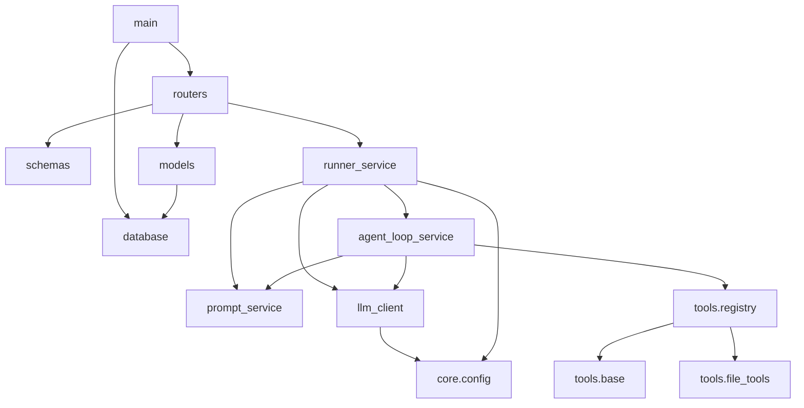
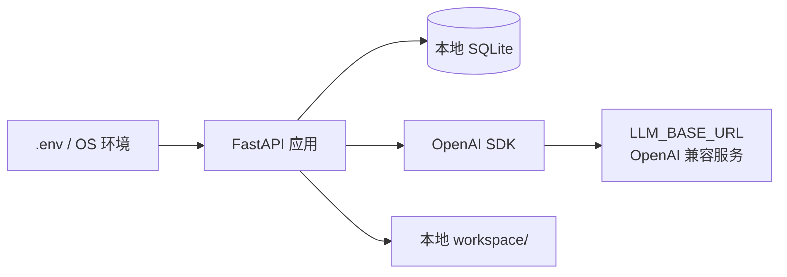

# 依赖关系

关联：[[04-核心模块拆解]] · [[10-待确认问题]]

## 依赖文件

只发现 `requirements.txt`；未发现 `pyproject.toml`、`package.json`、`pom.xml`、`build.gradle` 或 Dockerfile。

`requirements.txt` 是一个很大的精确版本清单，包含远超本项目直接需要的机器学习、文档、浏览器和 Agent 生态包。它可能由一个共享环境 `pip freeze` 生成，是否属于项目的最小可复现依赖，待确认。

## 源码直接依赖

| 依赖 | 当前锁定版本 | 用途 |
|---|---:|---|
| fastapi | 0.136.1 | API、Router、Depends、HTTPException |
| uvicorn | 0.44.0 | ASGI 开发服务器 |
| SQLAlchemy | 2.0.49 | ORM、Session、SQLite Engine |
| pydantic | 2.12.5 | Schema；文件工具还导入了兼容层 `pydantic.v1` |
| python-dotenv | 1.2.2 | 加载 `.env` |
| openai | 2.31.0 | OpenAI 兼容 Chat Completions |

标准库直接使用 `os`、`datetime`、`json`、`typing`、`pathlib`。

`tenacity` 只出现在 `workspace/sample_project` 的旧 Runner 中且未实际使用；主应用当前没有重试机制。

## 环境变量

| 变量 | 必需性 | 默认值/示例 | 消费方 |
|---|---|---|---|
| `LLM_BASE_URL` | 客户端初始化必需 | 示例为 DeepSeek API | `LLMClient` |
| `LLM_API_KEY` | 客户端初始化必需 | 示例占位 `xxx` | `LLMClient` |
| `LLM_MODEL` | 客户端初始化必需 | 示例 `deepseek-v4-pro` | `LLMClient` |
| `LLM_TIMEOUT` | 可选 | `60` | OpenAI client |
| `RUNNER_MODE` | 可选 | 代码默认 `fake` | `run_task()` |

实际 `.env` 被 `.gitignore` 排除，本地图没有记录其中的密钥。

## 内部模块依赖



## 外部服务依赖



未发现 Redis、Kafka、RabbitMQ、Celery、云数据库或对象存储。

## 启动依赖

```bash
pip install -r requirements.txt
uvicorn app.main:app --reload
```

由于数据库 URL 是相对路径，建议从项目根目录启动。Python 最低版本未明确声明；源码使用 `str | None`、`dict[str, ...]` 和 `removeprefix`，至少需要 Python 3.9，联合类型语法实际要求 Python 3.10+。
