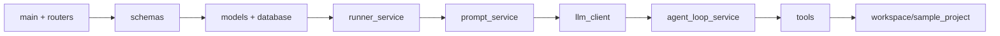

# 新手阅读路线

返回首页：[[00-项目总览]]

## 推荐路线

| 顺序 | 文件 | 重点 | 读完能理解 |
|---:|---|---|---|
| 1 | `app/main.py` | FastAPI 实例、建表、Router 挂载 | 程序从哪里启动 |
| 2 | `app/schemas.py` | 输入/输出字段、`from_attributes` | API 对外数据形状 |
| 3 | `app/models.py` | 四张表及 relationship | 数据如何组织 |
| 4 | `app/database.py` | Engine、SessionLocal、`get_db` | 请求如何取得数据库会话 |
| 5 | `app/routers/tasks.py` | 创建/查询 Task、启动 Run | 核心写请求入口 |
| 6 | `app/services/runner_service.py` | Run 生命周期、模式分派、异常处理 | 项目的业务主干 |
| 7 | `app/services/prompt_service.py` | 两套 prompt 协议 | 模型被要求做什么 |
| 8 | `app/services/llm_client.py` | 配置校验、Chat Completions | 外部模型如何接入 |
| 9 | `app/services/agent_loop_service.py` | parse、normalize、循环、save_step | Agent 如何决策和留痕 |
| 10 | `app/tools/base.py`、`registry.py`、`file_tools.py` | 工具抽象、注册、路径限制 | 模型如何读取项目文件 |
| 11 | `app/routers/runs.py` | 结果、日志、步骤查询 | 如何观察执行过程 |
| 12 | `workspace/sample_project/` | 与主应用的差异 | Agent 实际分析的对象 |

## 分阶段目标

### 第一阶段：先看“壳”

阅读 `main.py`、`routers/`、`schemas.py`。先回答三个问题：有哪些接口？输入是什么？输出是什么？此时不必深究 LLM。

### 第二阶段：理解状态

阅读 `models.py` 和 `database.py`，画出 Task → Run → Log/Step。重点区分：

- Task 是用户意图；
- Run 是一次具体执行；
- RunLog 是可读日志；
- RunStep 是 Agent 结构化轨迹。

### 第三阶段：理解核心执行

阅读 `runner_service.py`。这是最核心代码。跟踪：

`start_task_run` → `create_run` → 模式 Runner → `finish_run_success/failure` → `RunRead`。

### 第四阶段：理解 Agent

先看 prompt 中规定的 JSON，再读 `agent_loop_service.py`，最后读工具层。这样比从循环代码反推协议更容易。

## 容易卡住的地方

1. `llm_client` 是模块级单例，初始化发生在 import 时，而不是首次执行 LLM 时。
2. `RUNNER_MODE` 不只是配置；它决定同步请求走 Fake、单次 LLM 或多步 Agent。
3. Tool Agent 没使用 LangChain/LangGraph；它是普通 `for` 循环和自定义 JSON 协议。
4. 每个日志和 step 都会独立 commit，执行失败不代表此前记录回滚。
5. `workspace/sample_project` 看起来像应用副本，但实际上是工具读取范围内的样例数据。
6. Router 查询直接使用 ORM，项目没有 Repository 层。

## 阅读辅助

- 看全局结构：[[02-整体架构图]]
- 跟请求链：[[03-核心调用链]]
- 看数据关系：[[06-类和实体关系]]
- 查接口：[[07-API接口地图]]
- 看已知风险：[[10-待确认问题]]
