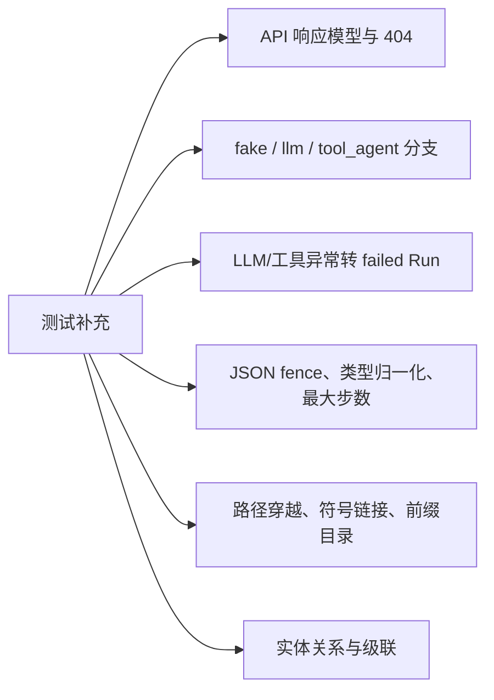

# 待确认问题

关联：[[00-项目总览]] · [[08-依赖关系]]

以下内容来自当前源码事实与保守推断；无法确定的设计意图均标为“待确认”。

## 需要问开发者

1. `workspace/sample_project/` 是固定教学样例、测试夹具，还是应该与主应用同步的镜像？待确认。
2. `RUNNER_MODE` 的合法值是否只允许 `fake`、`llm`、`tool_agent`？当前未知值会静默回退到 Fake。
3. `POST /tasks/{id}/runs` 是否预期同步等待 LLM？生产环境是否需要后台队列？待确认。
4. Task 的 status 表示“最近一次 Run”还是“聚合状态”？多次运行时语义待确认。
5. RunStep 达到最大步数后，当前函数返回一段文本，外层会把 Run 标为 success；这是否符合产品语义？待确认。
6. 是否需要保存完整 LLM 请求/响应、token 用量和模型元数据？待确认。
7. 是否允许工具读取符号链接指向的文件？当前 `resolve()` 后会做字符串前缀检查，但安全策略需要明确。
8. 数据库 schema 未来是否需要 Alembic 管理？当前只有 `create_all`。

## 明显风险与技术债

### 高优先级

- `app/tools/file_tools.py:get_project_tree()` 把 `path` 保持为字符串，却调用 `path.exists()`；会抛出异常并由注册表转成失败结果。应检查的是 `target_path.exists()`。
- `LLMClient` 在 import 时校验配置并实例化。缺少 LLM 配置可能让整个 API 无法启动，即便 `RUNNER_MODE=fake`。
- 所有执行均在同步 HTTP 请求内完成，慢 LLM 或 5 轮 Agent 容易导致请求超时和并发占用。

### 中优先级

- `safe_resolve_path()` 用字符串 `startswith` 判断目录边界；更稳妥的是 `Path.is_relative_to()`，以避免相同前缀目录造成边界混淆。
- 无测试目录，核心分支、错误恢复、路径安全和响应模型缺少自动回归保护。
- 无 Alembic；模型变化后 `create_all` 不会迁移已有表。
- 状态使用自由字符串，缺少 Enum/数据库约束。
- 每次日志和步骤单独 commit，部分成功状态可能永久保留。
- 列表接口没有分页。
- 未发现认证、授权和限流。

### 低优先级/整洁度

- `app/models.py` 与 `app/routers/runs.py` 有重复/未使用 import。
- `app/tools/file_tools.py` 导入未使用的 `pydantic.v1.PathError`。
- `requirements.txt` 非常庞大，包含大量源码未使用依赖和机器相关的 file URL，跨环境安装风险较高。
- 数据库时间同时使用 `datetime.utcnow` 和 `datetime.now`，且均为 naive datetime；时区策略待确认。
- `read_file()` 只按字符截断 8000，编码错误、二进制文件和超大目录行为未专门设计。

## 缺失文档

- 开发/生产部署说明。
- 环境变量与 Runner 模式契约。
- API 示例和错误码约定。
- 数据库迁移与备份策略。
- Agent JSON 协议版本与兼容策略。
- workspace 内容的生命周期和安全边界。
- 测试策略及最小支持 Python 版本。

## 建议优先补充的测试

